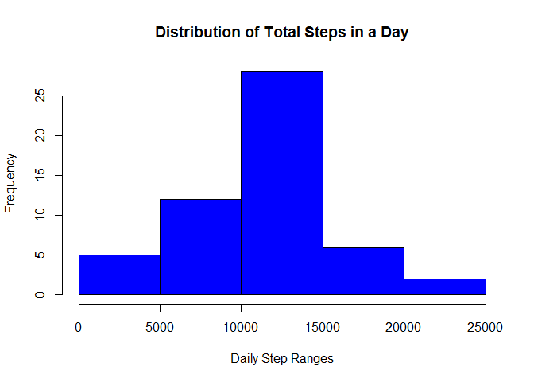
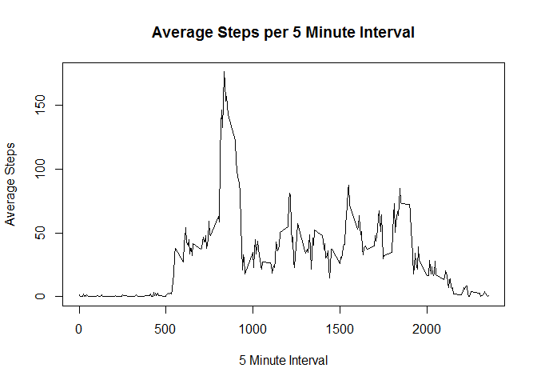
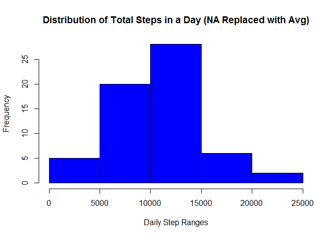
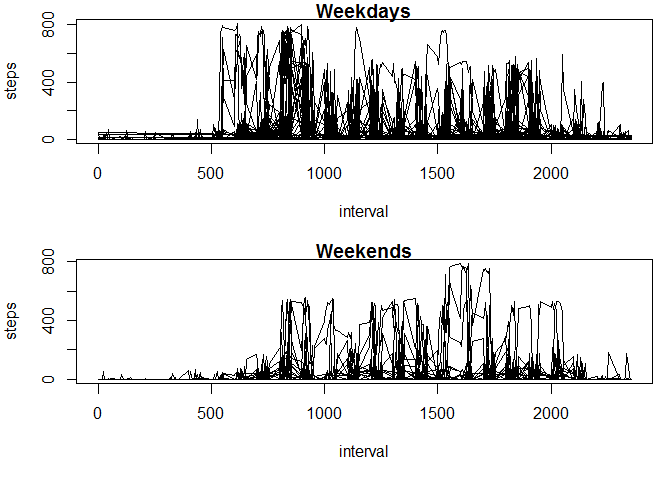

# Reproducible Research: Peer Assessment 1


## Loading and preprocessing the data
Load libraries and set wd

```r
library(dplyr)  
```

```
## 
## Attaching package: 'dplyr'
```

```
## The following objects are masked from 'package:stats':
## 
##     filter, lag
```

```
## The following objects are masked from 'package:base':
## 
##     intersect, setdiff, setequal, union
```

```r
setwd("C:/Users/tmcadams/Dropbox/Coursera")
####loading data
ActivityData <- read.csv("activity.csv")
ActivityData$Date2 <- as.Date(ActivityData$date, "%Y-%m-%d")
ActivityData_NoNA <- ActivityData[!is.na(ActivityData$steps), 1:4]
ActivityData_NA <- ActivityData[is.na(ActivityData$steps), 1:4]
```


## What is mean total number of steps taken per day?

Distribution of  Total Steps Per Day

```r
###getting steps in a day
StepsEachDayTotal <- group_by(ActivityData_NoNA , Date2) %>% summarise(TotalSteps = sum(steps))
hist(StepsEachDayTotal$TotalSteps, xlab = "Daily Step Ranges", col = "blue", main = "Distribution of Total Steps in a Day")
```




Mean and Median

```r
MeanStepsPerDay = mean(StepsEachDayTotal$TotalSteps)
MedianStepsPerDay = median(StepsEachDayTotal$TotalSteps)
print(MeanStepsPerDay)
```

```
## [1] 10766.19
```

```r
print(MedianStepsPerDay)
```

```
## [1] 10765
```

## What is the average daily activity pattern?

```r
StepsEachInterval <- group_by(ActivityData_NoNA , interval) %>% summarise(TotalSteps = sum(steps)/62)
plot(StepsEachInterval$interval,StepsEachInterval$TotalSteps,  type = "l", main = "Average Steps per 5 Minute Interval", xlab = "5 Minute Interval", ylab = "Average Steps")
```



Which 5 minute interval had the highest average?

```r
MaxSteps <- max(StepsEachInterval$TotalSteps)
MaxIntervalAvg <- StepsEachInterval[StepsEachInterval$TotalSteps == MaxSteps, ]
print(MaxIntervalAvg)
```

```
## Source: local data frame [1 x 2]
## 
##   interval TotalSteps
##      (int)      (dbl)
## 1      835   176.2419
```
## Imputing missing values

We have the average steps per 5 minute interval here: StepsEachInterval
We will plug in the average 5 minute interval whenver there is an NA value

Total Number of NA rows

```r
nrow(ActivityData_NA)
```

```
## [1] 2304
```
Merging NA data with 5 minute average and then into the data without NA dataset

```r
ActivityData_NA_merged <- merge(ActivityData_NA, StepsEachInterval, by.x="interval", by.y="interval")
dim(ActivityData_NA_merged)
```

```
## [1] 2304    5
```

```r
ActivityData_NA_merged$steps <- ActivityData_NA_merged$TotalSteps
ActivityData_NA_merged <- ActivityData_NA_merged[, 1:4]
Full_Activity_Nona <- rbind(ActivityData_NA_merged, ActivityData_NoNA)
dim(Full_Activity_Nona)
```

```
## [1] 17568     4
```

```r
head(Full_Activity_Nona)
```

```
##   interval    steps       date      Date2
## 1        0 1.467742 2012-10-01 2012-10-01
## 2        0 1.467742 2012-11-30 2012-11-30
## 3        0 1.467742 2012-11-04 2012-11-04
## 4        0 1.467742 2012-11-09 2012-11-09
## 5        0 1.467742 2012-11-14 2012-11-14
## 6        0 1.467742 2012-11-10 2012-11-10
```

Are there differences in activity patterns after the NA values are filled in?

```r
StepsEachDayTotal_FillNA <- group_by(Full_Activity_Nona , Date2) %>% summarise(TotalSteps = sum(steps))
hist(StepsEachDayTotal_FillNA$TotalSteps, xlab = "Daily Step Ranges", col = "blue", main = "Distribution of Total Steps in a Day (NA Replaced with Avg)")
```




Mean and Median after filling in NA data

```r
MeanStepsPerDay_NAFilled = mean(StepsEachDayTotal_FillNA$TotalSteps)
MedianStepsPerDay_NAFilled = median(StepsEachDayTotal_FillNA$TotalSteps)
print(MeanStepsPerDay_NAFilled)
```

```
## [1] 10561.23
```

```r
print(MedianStepsPerDay_NAFilled)
```

```
## [1] 10395
```
Compared to without NAs filled in

```r
print(MeanStepsPerDay)
```

```
## [1] 10766.19
```

```r
print(MedianStepsPerDay)
```

```
## [1] 10765
```


## Are there differences in activity patterns between weekdays and weekends?

```r
Full_Activity_Nona$DayOfWeek <-   weekdays(Full_Activity_Nona$Date2)

par(mfrow = c(2,1), mar = c(5,4,1,1))
with(subset(Full_Activity_Nona, DayOfWeek %in% c('Monday','Tuesday', 'Wednesday','Thursday','Friday')), plot(interval, steps, main = "Weekdays", type = "l"))
with(subset(Full_Activity_Nona, DayOfWeek %in% c('Saturday','Sunday')), plot(interval, steps, main = "Weekends", type = "l"))
```


